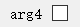

[toc]

# Clarisse


:us::<a href="./README.md">README</a>

Clarisse 是一个轻量化的Python程序的GUI生成框架。

只需要最少一行代码，不需对逻辑代码做任何修改，就可以生成一个易于交互的图形界面！

### 太长不看版使用说明

假设你有一个函数长这样：

```python
def func(arg1,arg2:int,arg3:str="have a try")->bool:
    ...
```

若要给它添加一个GUI，只需：

```python
from clarisse import Clarisse

@Clarisse()
def func(arg1,arg2:int,arg3:str="have a try")->bool:
    ...
```

收工。

在其他代码中，只要调用`func()`，就可以显示出一个GUI允许用户手动输入/调整/检查传递给函数的各参数的值，并可以运行该函数。

```python
@Clarisse()
def func(arg1,arg2:int,arg3:str="have a try") -> bool:
    """This is only a ***test*** function\\
    but enough to show what clarisse can do!"""
    print("arg1 is {0}".format(arg1))
    print(arg3.upper())
    return arg2>10

print(func("this is output",0))
```


##### Clarisse 理解你的需求！

在上面的例子中，`func()`仍然返回原型中的`bool`类型（就像完全没有改动一样）；调用时所给的参数将会成为参数的默认值，显示在GUI中。

##### Clarisse 提供试错机会！

可以通过在GUI中多次点击Run按钮来多次运行`func()`，并在Output窗口中查看输出；只有在关闭整个GUI后，最后一次的返回结果才会被传递到调用函数的代码，继续运行。

### 安装

```bash
#pip install clarisse
```

Clarisse 使用PySide2作为它的GUI实现框架。

Clarisse 在Python 3.9.1上测试通过。

### 自定义

1. 在使用`@Clarisse()`后，有两种方式设置显示在GUI中的默认值：在 函数定义头部（即`def`），或者调用函数时。后者将覆盖前者。
2. 显示的GUI窗口有以下设置选项，可通过在 `@Clarisse`后加参数来调整。
   1. `margin` 是窗体到控件的边距；
   2. `vert_spacing` 是控件间的间距；
   3. `description` 是显示的介绍性文字，默认值为`func.__doc__`，但也可以设置为你想显示的其他文字。
   4. `args_desc` 是一个字符串列表，你可以通过它来对变量的具体内容进行说明，取代默认的变量名称。
   5. `args_kwdesc` 与 `args_desc`相似, 但采用`dict`类型，格式类似于  `{[变量名]:[变量说明文字]}`.
3. Clarisse 兼容 PyInstaller。被Pyinstaller打包的可执行文件可以正常地运行。

##### 类型说明

Clarisse通过判断变量的类型来选择不同的控件以显示函数的每个变量。

如果某个变量类型不被当前的Clarisse支持，它会使用一个内置的 `ClrsUnknown`控件来显示这个变量的信息。在这种情况下，该控件的返回值将是字符串类型 `str`。

| 变量类型 | Clarisse 控件 | example                    |
| -------- | ------------- | -------------------------- |
| `int`    | 整数调节框    |  |
| `float`  | 小数调节框    |  |
| `str`    | 单行编辑框    |  |
| `bool`   | 复选框        |  |
| `list`   | 文本编辑框    |  |
| `dict`   | 列表          |  |

##### 注意事项

- 如果你用 `typing.List[a_type,...]` 标注变量类型, Clarisse 在返回这个变量的值时会以`a_type.__init__(arg_text:str)`的方式调用构造函数，返回一个 `a_type`类型的对象。确保`a_type`可以这样调用构造函数。
- 如果你用 `typing.Dict[key_type,value_type,...]` 标注变量类型, Clarisse 在返回这个变量的值时会以`key_type.__init__(key_text:str)`和`value_type.__init__(value_text:str)` 的方式调用构造函数，返回一个 `{key_type:value_type}`类型的字典类型对象。确保`key_type`和`value_type`可以这样调用构造函数。

##### 图标

Clarisse会自动加载当前目录下的图标文件。

比如，如果被 `@Clarisse()`装饰的函数名为`func()` , Clarisse会自动在当前目录下寻找`func.ico` 。

这个图标文件也可以被`icon`变量所指定。

```python
@Clarisse(icon="<path-to-icon>.ico")
```

这将自动加载 `<path-to-icon>.ico` 作为窗口图标。

##### 单次运行

通过设置Clarisse，可以让传入的函数只运行一次后就退出。

将`single_pass`参数设为`True`来让GUI在函数运行结束后立刻退出： `@Clarisse(single_pass=True)` 

##### Docstring的处理

在绝大多数场合，Clarisse会自动读取函数的docstring(即 `func.__doc__`)并把它们显示出来，作为对其功能的简要介绍。不过，如果你已经写好了一个精巧的docstring，Clarisse也会对它善加利用。

现在，如果函数有一个numpy风格的docstring，Clarisse会把连续的六个连字符(`------`)当做段落与段落之间的分割标记，这也是Markdown语法中的分割线标记。第一个段落将被截取出来作为介绍。

##### 范例

```python
@Clarisse(
    margin=10,
    vert_spacing=10,
    description="""another description. \\
         Note that this description is <font color=#ff0000>prior</font> than \\
         func.\_\_doc\_\_ .""")
def func(arg1,arg2:int,arg3:str="have a try") -> bool:
    """This is only a ***test*** function\\
    but enough to show what clarisse do!"""
    print("arg1 is {0}".format(arg1))
    print(arg3.upper())
    return arg2>10

print(func("this is clarisse output",0))
```


```python
@Clarisse(args_desc=("This is arg1","This is arg2, label warps if it is too long"),args_kwdesc={"arg3":"an example to show args_kwdesc"})
def func(arg1,arg2:int,arg3:str="have a try") -> bool:
    """This is only a ***test*** function\\
    but enough to show what clarisse do!"""
    print("arg1 is {0}".format(arg1))
    print(arg3.upper())
    return arg2>10

print(func())
# actually doesn't need parameters when calling,
# but need to be given before Run is clicked.
```


```python
@Clarisse(single_pass=True)
def f(this_is_arg1:int,this_is_arg2:str,this_is_arg3:list):
    """
    ...				#<- numpy.ndarray.__doc__
    """
```


### 看起来不错，但是...

*为什么不用gooey呢?*

<a href="https://github.com/chriskiehl/Gooey">Gooey</a> 是一个出色的，全面的，应用范围广泛的Python程序GUI化框架，但是它

- 需要修改（相对较多的）代码；
- 需要自己实现一个 `ArgumentParser`模块的调用 :  `fire` 和 `click` 表示遗憾 :cry:
- 需要一个命令行调用的接口；
- ~~我没学会用——gooey的教程太太太长了！要写一个可以看到的界面需要蛮多代码的 :sob:~~

如果你熟悉gooey，需要高度可定制化的GUI界面，那我当然推荐你使用gooey；但是如果你正在寻找一个轻量化，无痛嵌入，快速部署的GUI框架，也许你可以试试Clarisse！

### 我想参与改进！

完全欢迎——事实上，作为一个*打注释强迫症星人*，~10%的代码都是解释这段代码在做什么的注释，这使得重构和接续开发要相对容易的多。我也计划写一些说明文档来介绍每个模块是做什么的。

如果你遇到了一些意☆义☆不☆明的谜之代码，可以随时直接问我。

如果你不对直接贡献代码有兴趣，也可以在[patch](./patch.md)的*future*部分找到讨论新功能的提案入口。

### ...以及，未来的新功能！

- [ ] 未来会有更多可以更换的布局；
- [ ] 也将可以使用QSS样式表（类似于CSS样式表）来美化控件和窗体；
- [ ] Clarisse将添加对于类的支持；
- [ ] 也会增加对更多类型的支持；

......

### FAQ

- Q: 报错:`qt.qpa.plugin: Could not load the Qt platform plugin "***" in ...`

  - A: 你没有完整的Qt运行库，或是PySide2没能找到它们。

    在Windows平台上，将下列文件

    ```
    \Anaconda3\Lib\site-packages\PySide2\plugins\platforms\qminimal.dll
    \Anaconda3\Lib\site-packages\PySide2\plugins\platforms\qoffscreen.dll
    \Anaconda3\Lib\site-packages\PySide2\plugins\platforms\qwindows.dll
    ```

    复制到

    `\Anaconda3\Library\plugins\platforms\`。

    在Linux平台（测试使用Ubuntu 18.04），尝试 `apt install python3-pyqt5`。

- Q: 报错:`qt.qpa.plugin: Could not find the Qt platform plugin “***“ in ... `

  - A: PyQt5/PySide2 只是Qt和Python的binding，本身并不能实现功能，实现功能需要对应平台的Qt plugin。

    在`import` 部分后加入这段代码：

    ```python
    import PySide2
    import os
    
    dirname = os.path.dirname(PySide2.__file__) 
    plugin_path = os.path.join(dirname, 'plugins', 'platforms')
    os.environ['QT_QPA_PLATFORM_PLUGIN_PATH'] = plugin_path
    ```

    或者你也可以写个新的.py文件并在代码中import它，只要保证在Clarisse调用前执行即可。

### 致谢

感谢 <a href="https://github.com/google/python-fire/">fire</a> 包给我的启发；

感谢 <a href="https://github.com/google/latexify_py/">latexify_py</a> 包，Clarisse接口的设计和对于Python语法的分析均来自于我在这个包中所学到的知识； ~~这包好用极了快去用顺便点个star~~

感谢 <a href="https://www.fanfiction.net/u/1596712/Hieronym">@Hieronym</a>, 创作了 *<a href="https://www.fanfiction.net/s/7406866/1/To-the-Stars">飞向星空</a>* ~~这是我看过最好的同人太空歌剧小说！~~，也是本框架的取名来源。


1MLightyears

20201215